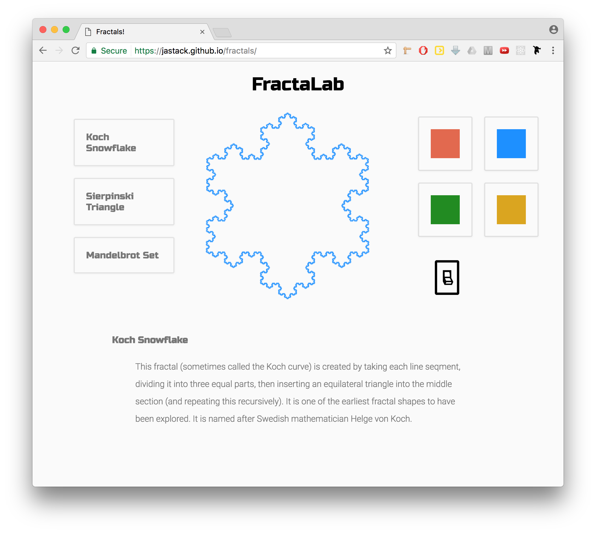

# FractaLab

## Background

[FractaLab] is a fractal generator application to allow users to explore three different famous fractals -- the Koch Snowflake, the Sierpinski Triangle, and the Mandelbrot Set.

FractaLab is built with only HTML5 and Javascript -- utilizing HTML5 Canvas and CSS3 to render the fractals and Javascript to perform the calculations behind-the-scenes.

[FractaLab]: https://jastack.github.io/fractals

## Features

Includes the following three fractals:
  * Koch Snowflake
  * Sierpinski Triangle
  * Mandelbrot Set

Allows user to interact with fractals through:  
  * Hover build
  * Variable colors
  * Change background for more contrast

The generator also includes information about each fractal.

## Technologies and Methodology

FractaLab is able to produce fractals using only HTML5 and Javascript. The main page includes three canvas items stacked on top of each other. Each canvas can be turned on through Javascript functions that toggle the opacity levels.

The fractal generation for the first two fractals (Koch Snowflake and Sierpinski Triangle) comes through the implementation of a recursive function. I added an event listener to tell when a user's mouse hovers over the canvas. The x-coordinate of the mouse is then passed to the fractal generator functions, which then determines which step to render.

The third fractal, while a little less user-interactive, goes through the canvas pixel-by-pixel to determine which coordinates belong in the set. It runs an iterative loop which can last for up to 100 iterations. If the coordinate is still within the "escape value" (which, in this case, is 4), the pixel is colored black. Otherwise is it colored a specific shade based on how many iterations it took to escape.

## Future Features

I have the zoom and and feature all set for the Mandelbrot set. The only problem is that since it's such a computation-heavy display, making any coordinate changes takes a long time. I need to think more about a way to implement this without making the site seem really slow.

Add more fractal options. Add animation. Add a clearly diagramed/animated explanation of the math behind fractals.
